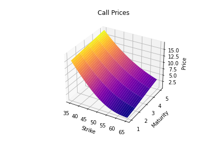
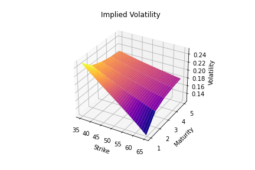
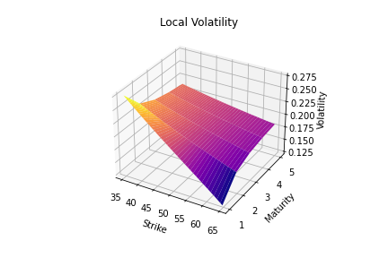
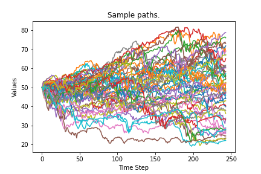
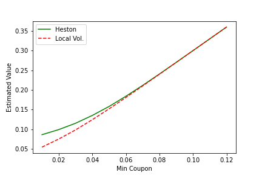

  - [1
    Introduction](#introduction)
  - [2 The Characteristic
    Function Route to Implied and Local
    Volatility](#the-characteristic-function-route-to-implied-and-local-volatility)
  - [3 Monte
    Carlo](#monte-carlo)
  - [4 Using The Ito Language To
    Investigate Exotic
    Pricing](#using-the-ito-language-to-investigate-exotic-pricing)

# Introduction

Vollab (Volatility Laboratory) is a python package for testing out
different approaches to volatility modelling within the field of
mathematical finance. The package is free to use for academic and
research purposes. For any related commercial applications you are
recommended to consult with the author. Notebooks demonstrating use of
the Ito language for investigating the prices of exotics are now
included.

# The Characteristic Function Route to Implied and Local Volatility

Vollab contains an implementation of the Fast Fourier Transform method
of Carr and Madan for calculating the prices of European call options,
for stochastic processes with known characteristic function.
Characteristic functions for Geometric Brownian Motion (Black-Scholes)
and Heston’s stochastic volatility model are provided.

The figure below illustrates call prices produced using FFT for the
Heston model.

After production of call prices, Jackel’s "Lets Be Rational" methodology
can be used to rapidly convert call prices to the implied volatility
surface.

Finally implied volatility can be transformed to local volatility using
Dupire’s formula.

# Monte Carlo

Vollab contains Monte Carlo samplers, for Geometric Brownian Motion
(Black-Scholes), Heston’s stochastic volatility model and Local
Volatility. One use of the samplers is to estimate prices by expectation
in the appropriate probability measure.

# Using The Ito Language To Investigate Exotic Pricing

The listing below defines an example of an exotic product in the Ito
language, the Locally Capped Globally Floored Cliquet

    # Mediobanca Bond Protection 2002-2005, ISIN IT0003391353
    #
    # Locally Capped Globally Floored Cliquet
    #
    underlying = "STOXX";
    #
    minCoupon = 0.02;
    #
    currency = "EUR";
    #
    notionalAmount = 1.0;
    #
    get notionalAmount * coupon[1] in currency on couponDates[1];
    get notionalAmount * coupon[2] in currency on couponDates[2];
    get notionalAmount * coupon[3] in currency on couponDates[3];
    #
    coupon[c] = max[sumReturns[c], minCoupon];
    #
    sumReturns[c] = sum[resetReturns[endDates[c], startDates[c]]];
    #
    resetReturns[{}, {}] = {};
    resetReturns[t:ts, tm:tms] = min[max[r[t, tm], -0.01],  0.01] : resetReturns[ts, tms];
    #
    r[t, tMinus] = performance[s[t], s[tMinus]];
    #
    performance[st,stMinus] = (st - stMinus) / stMinus;
    #
    s[t] = Observe[underlying, t];
    #
    startDates[c] = dropTail[resetDates[c]];
    #
    endDates[c] = dropHead[resetDates[c]];
    #
    couponDates[1] = '2002-12-02';
    couponDates[2] = '2003-12-02';
    couponDates[3] = '2004-12-02';
    #
    resetDates[1] = {
    '2002-01-02',
    '2002-01-02',
    '2002-02-02',
    '2002-03-02',
    '2002-04-02',
    '2002-05-02',
    '2002-06-02',
    '2002-07-02',
    '2002-08-02',
    '2002-09-02',
    '2002-10-02',
    '2002-11-02',
    '2002-11-25'};
    #
    resetDates[2] = {
    '2003-01-02',
    '2003-01-02',
    '2003-02-02',
    '2003-03-02',
    '2003-04-02',
    '2003-05-02',
    '2003-06-02',
    '2003-07-02',
    '2003-08-02',
    '2003-09-02',
    '2003-10-02',
    '2003-11-02',
    '2003-11-25'
    };
    #
    resetDates[3] = {
    '2004-01-02',
    '2004-01-02',
    '2004-02-02',
    '2004-03-02',
    '2004-04-02',
    '2004-05-02',
    '2004-06-02',
    '2004-07-02',
    '2004-08-02',
    '2004-09-02',
    '2004-10-02',
    '2004-11-02',
    '2004-11-25'
    };
    #
    # remove the head (first entry) from the list
    dropHead[{}] = {};
    dropHead[{x}] = {};
    dropHead[x:xs] = xs;
    # remove the tail (last entry) from the list
    dropTail[{}] = {};
    dropTail[{x}] = {};
    dropTail[x:xs] = x : dropTail[xs];
    # minimum of two numbers.
    min[x,y] = if x < y then x else y endif;
    # maximum of two numbers.
    max[x,y] = if x < y then y else x endif;
    # sum of a list of numbers
    sum[{}] = 0;
    sum[{x}] = x;
    sum[x:xs] = x + sum[xs];

Two different models that match the prices of plain-vanilla options can
give quite different prices for exotics. This is commonly summarised by
stating exotics can be forward skew dependent. The notebooks make use of
the Ito language to demonstrate these differences. The figure below
illustrates the divergence in price as a function of the "Min Coupon"
parameter, between the Heston model and Local Volatility. For more about
exotics see the discussion in, "The volatility surface: a practitioner’s
guide".

